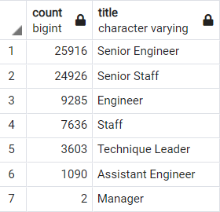
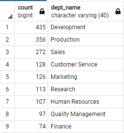

# Pewlett-Hackard-Analysis
## Overview of Project
Determining the number of retiring employees per title, to be prepared for the baby boomer retirement “silver tsunami”, and identify employees who are eligible to participate Mentorship Program.

## Results:
-  We can see that 72,458 employees were born between 1952 and 1955 and will be retired in the next few years.
-  36% of the employees that were born between 1952 and 1955 are Senior Engineer (25,916 employees)
-  34% of the employees that were born between 1952 and 1955 are Senior Staff (24,926 employees) retiring_titles.png)

- 1,549 employees were born in 1965 and eligible for the Mentorship Program.

## Summary
1. When the "silver tsunami" begins to make an impact we will need to feel 72,458 roles. 
2. We can see that there are 1,549 employees eligible for the Mentorship Program, those employees are in the following departments. 

